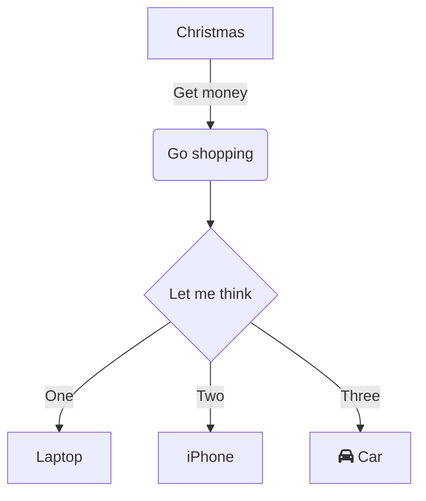

# dita-ot-markdown-html5-diagrams-plugin

The DITA Open Toolkit plugin processes mermaid codeblocks in markdown for valid html5 `pre` elements that can be rendered online by MermaidJS.

https://mermaid-js.github.io

The plugin was tested and developed with DITA OT 4.3.

If your markdown input contains fenced codeblock with language set to `mermaid`, this plug does the following to the html5 transformation:

1. Inject MermaidJS to html5 from CDN: `https://cdn.jsdelivr.net/npm/mermaid@11/dist/mermaid.esm.min.mjs`
2. Remove the nested `code` tags inside `pre` when converting markdown mermaid codeblocks to html5, otherwise mermaidjs will raise an error.
3. Override the default `language-mermaid` class with `mermaid`, saving you the effort to set `querySelector` in javascript with [mermaid.run](https://mermaid.js.org/config/usage.html#using-mermaid-run).

> [!NOTE]
> If you are looking for using mermaidjs in dta xml, go to https://github.com/oxygenxml/dita-ot-diagrams-plugin .

## Installation

The DITA OT plugin folder **com.drewzhao.md-html5-mermaidjs** can be manually downloaded, copied to a DITA Open Toolkit **plugins** folder and then installed using the **dita --install** command line.

## Usage

The plugin is used to process mermaid codeblocks when using markdown as input for DITA Open Toolkit.

The plugin adds a new transtype `md-html5-mermaidjs`:

```shell
dita --input=/path/to/your.ditamap --format=md-html5-mermaidjs
```

## Example

Here a markdown fenced codeblock with language set to mermaid:

~~~~markdown

~~~~

## Security

The Mermaid-based diagram is generated by the Mermaid javascript from `https://cdn.jsdelivr.net/npm/mermaid@11/dist/mermaid.esm.min.mjs` in the HTML footer.

  
Copyright and License
---------------------
Copyright 2025

This project is licensed under [Apache License 2.0](https://github.com/oxygenxml/dita-ot-diagrams-plugin/blob/master/LICENSE).
